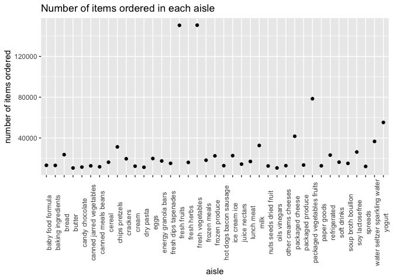
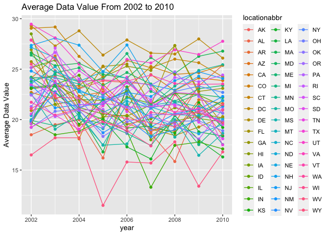
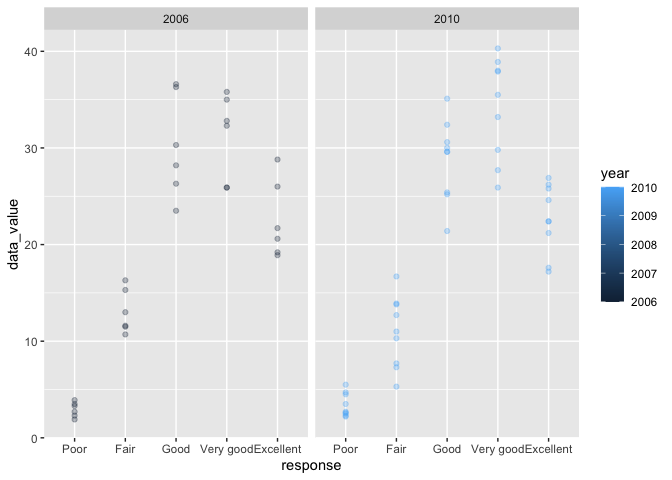
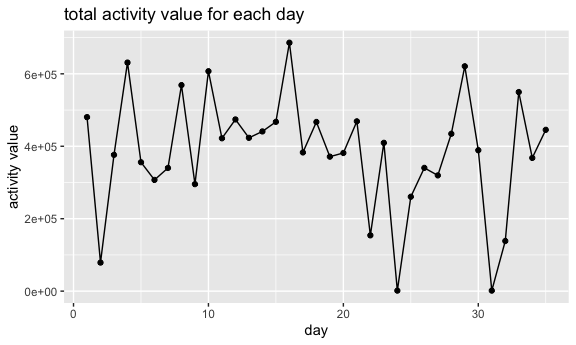
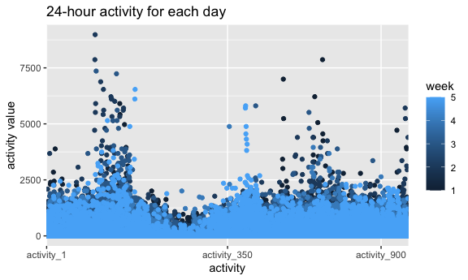

p8105_hw3_zy2378
================
zy
10/18/2021

``` r
library(p8105.datasets)
library(tidyverse)
```

    ## ─ Attaching packages ──────────────────── tidyverse 1.3.1 ─

    ## ✓ ggplot2 3.3.3     ✓ purrr   0.3.4
    ## ✓ tibble  3.1.1     ✓ dplyr   1.0.7
    ## ✓ tidyr   1.1.3     ✓ stringr 1.4.0
    ## ✓ readr   2.0.1     ✓ forcats 0.5.1

    ## ─ Conflicts ───────────────────── tidyverse_conflicts() ─
    ## x dplyr::filter() masks stats::filter()
    ## x dplyr::lag()    masks stats::lag()

``` r
library(dplyr)
library(ggplot2)
data("instacart")
data("brfss_smart2010")
instacart
```

    ## # A tibble: 1,384,617 x 15
    ##    order_id product_id add_to_cart_order reordered user_id eval_set order_number
    ##       <int>      <int>             <int>     <int>   <int> <chr>           <int>
    ##  1        1      49302                 1         1  112108 train               4
    ##  2        1      11109                 2         1  112108 train               4
    ##  3        1      10246                 3         0  112108 train               4
    ##  4        1      49683                 4         0  112108 train               4
    ##  5        1      43633                 5         1  112108 train               4
    ##  6        1      13176                 6         0  112108 train               4
    ##  7        1      47209                 7         0  112108 train               4
    ##  8        1      22035                 8         1  112108 train               4
    ##  9       36      39612                 1         0   79431 train              23
    ## 10       36      19660                 2         1   79431 train              23
    ## # … with 1,384,607 more rows, and 8 more variables: order_dow <int>,
    ## #   order_hour_of_day <int>, days_since_prior_order <int>, product_name <chr>,
    ## #   aisle_id <int>, department_id <int>, aisle <chr>, department <chr>

``` r
brfss_smart2010
```

    ## # A tibble: 134,203 x 23
    ##     Year Locationabbr Locationdesc  Class  Topic Question   Response Sample_Size
    ##    <int> <chr>        <chr>         <chr>  <chr> <chr>      <chr>          <int>
    ##  1  2010 AL           AL - Jeffers… Healt… Over… How is yo… Excelle…          94
    ##  2  2010 AL           AL - Jeffers… Healt… Over… How is yo… Very go…         148
    ##  3  2010 AL           AL - Jeffers… Healt… Over… How is yo… Good             208
    ##  4  2010 AL           AL - Jeffers… Healt… Over… How is yo… Fair             107
    ##  5  2010 AL           AL - Jeffers… Healt… Over… How is yo… Poor              45
    ##  6  2010 AL           AL - Jeffers… Healt… Fair… Health St… Good or…         450
    ##  7  2010 AL           AL - Jeffers… Healt… Fair… Health St… Fair or…         152
    ##  8  2010 AL           AL - Jeffers… Healt… Heal… Do you ha… Yes              524
    ##  9  2010 AL           AL - Jeffers… Healt… Heal… Do you ha… No                77
    ## 10  2010 AL           AL - Jeffers… Healt… Unde… Adults ag… Yes              316
    ## # … with 134,193 more rows, and 15 more variables: Data_value <dbl>,
    ## #   Confidence_limit_Low <dbl>, Confidence_limit_High <dbl>,
    ## #   Display_order <int>, Data_value_unit <chr>, Data_value_type <chr>,
    ## #   Data_Value_Footnote_Symbol <chr>, Data_Value_Footnote <chr>,
    ## #   DataSource <chr>, ClassId <chr>, TopicId <chr>, LocationID <chr>,
    ## #   QuestionID <chr>, RESPID <chr>, GeoLocation <chr>

## Data Description

The Instacart data contains observations on 1384617 orders from
instacart store online. The data include 15 variables, and are the
characteristics of the orders and the product，including product name,
product id, order name, etc. For observation at row1, the order is id is
1, and product id is 49302, the order that the product was add to chart
is 1, and it have been ordered before by this customer. The user id is
112108, and the order belongs to the train evaluation set. The order
number for this user is 4, and the order was placed on Thursday 10am. It
have been 9 days since this user’s last order, and the product is
Bulgarian Yogurt. The aisle id is 120, and the product belongs to the
yogurt aisle. The department id is 16, and is dairy eggs.

##Problem 1

``` r
aisle_df1=
  instacart%>%
  group_by(aisle)%>%
  summarize(n_obs=n())%>%
  mutate(rank=rank(n_obs))
aisle_df1
```

    ## # A tibble: 134 x 3
    ##    aisle                  n_obs  rank
    ##    <chr>                  <int> <dbl>
    ##  1 air fresheners candles  1067    26
    ##  2 asian foods             7007    82
    ##  3 baby accessories         306     3
    ##  4 baby bath body care      328     4
    ##  5 baby food formula      13198   109
    ##  6 bakery desserts         1501    36
    ##  7 baking ingredients     13088   108
    ##  8 baking supplies decor   1094    29
    ##  9 beauty                   287     1
    ## 10 beers coolers           1839    45
    ## # … with 124 more rows

``` r
aisle_df2=
  aisle_df1%>%
  filter(n_obs>=10000)%>%
  select(-rank)
aisle_df2
```

    ## # A tibble: 39 x 2
    ##    aisle                    n_obs
    ##    <chr>                    <int>
    ##  1 baby food formula        13198
    ##  2 baking ingredients       13088
    ##  3 bread                    23635
    ##  4 butter                   10575
    ##  5 candy chocolate          11453
    ##  6 canned jarred vegetables 12679
    ##  7 canned meals beans       11774
    ##  8 cereal                   16201
    ##  9 chips pretzels           31269
    ## 10 crackers                 19592
    ## # … with 29 more rows

``` r
ggplot(aisle_df2,aes(x=aisle,y=n_obs))+
  geom_point()+
  theme(axis.text.x=element_text(angle=90))+
  labs(
    title = "Number of items ordered in each aisle",
    x = "aisle",
    y = "number of items ordered")
```

<!-- -->

1.There are 134 aisles, and the most items that ordered from is the
fresh vagetables aisle.

``` r
baking_ingredients_df=
  instacart%>%
  filter(aisle=="baking ingredients")%>%
  group_by(product_name)%>%
  summarize(n_obs=n())%>%
  mutate(rank=rank(n_obs))%>%
  filter(rank>=521)%>%
  select(-rank)%>%
  mutate(aisle=c("baking ingredients","baking ingredients","baking ingredients"))%>%
  select(aisle,product_name,n_obs)
baking_ingredients_df
```

    ## # A tibble: 3 x 3
    ##   aisle              product_name      n_obs
    ##   <chr>              <chr>             <int>
    ## 1 baking ingredients Cane Sugar          336
    ## 2 baking ingredients Light Brown Sugar   499
    ## 3 baking ingredients Pure Baking Soda    387

``` r
dog_food_care_df=
  instacart%>%
  filter(aisle=="dog food care")%>%
  group_by(product_name)%>%
  summarize(n_obs=n())%>%
  mutate(rank=rank(n_obs))%>%
  filter(rank>=353)%>%
  select(-rank)%>%
  mutate(aisle=c("dog food care","dog food care","dog food care"))%>%
  select(aisle,product_name,n_obs)
dog_food_care_df
```

    ## # A tibble: 3 x 3
    ##   aisle         product_name                                  n_obs
    ##   <chr>         <chr>                                         <int>
    ## 1 dog food care Organix Chicken & Brown Rice Recipe              28
    ## 2 dog food care Small Dog Biscuits                               26
    ## 3 dog food care Snack Sticks Chicken & Rice Recipe Dog Treats    30

``` r
packaged_vegetables_fruits_df=
  instacart%>%
  filter(aisle=="packaged vegetables fruits")%>%
  group_by(product_name)%>%
  summarize(n_obs=n())%>%
  mutate(rank=rank(n_obs))%>%
  filter(rank>=564)%>%
  select(-rank)%>%
  mutate(aisle=c("packaged vegetables fruits","packaged vegetables fruits","packaged vegetables fruits"))%>%
  select(aisle,product_name,n_obs)
packaged_vegetables_fruits_df
```

    ## # A tibble: 3 x 3
    ##   aisle                      product_name         n_obs
    ##   <chr>                      <chr>                <int>
    ## 1 packaged vegetables fruits Organic Baby Spinach  9784
    ## 2 packaged vegetables fruits Organic Blueberries   4966
    ## 3 packaged vegetables fruits Organic Raspberries   5546

``` r
bind_rows(baking_ingredients_df,dog_food_care_df,packaged_vegetables_fruits_df)
```

    ## # A tibble: 9 x 3
    ##   aisle                      product_name                                  n_obs
    ##   <chr>                      <chr>                                         <int>
    ## 1 baking ingredients         Cane Sugar                                      336
    ## 2 baking ingredients         Light Brown Sugar                               499
    ## 3 baking ingredients         Pure Baking Soda                                387
    ## 4 dog food care              Organix Chicken & Brown Rice Recipe              28
    ## 5 dog food care              Small Dog Biscuits                               26
    ## 6 dog food care              Snack Sticks Chicken & Rice Recipe Dog Treats    30
    ## 7 packaged vegetables fruits Organic Baby Spinach                           9784
    ## 8 packaged vegetables fruits Organic Blueberries                            4966
    ## 9 packaged vegetables fruits Organic Raspberries                            5546

2.The three most popular items in the baking ingredients aisle is Cane
Sugar, Light Brown Sugar, Pure Baking Soda, in the dog food care aisle
is Organix Chicken & Brown Rice Recipe, Small Dog Biscuits, Snack Sticks
Chicken & Rice Recipe Dog Treats, and in the packaged vegetables fruits
aisle is Organic Baby Spinach, Organic Blueberries, Organic Raspberries.

``` r
pink_lady_apples_df=
  instacart%>%
  filter(product_name=="Pink Lady Apples")%>%
  select(product_name,order_dow,order_hour_of_day)%>%
  group_by(order_dow)%>%
  summarize(mean=mean(order_hour_of_day))%>%
  mutate(product_name=rep("Pink Lady Apples",7))%>%
  select(product_name,order_dow,mean)
pink_lady_apples_df
```

    ## # A tibble: 7 x 3
    ##   product_name     order_dow  mean
    ##   <chr>                <int> <dbl>
    ## 1 Pink Lady Apples         0  13.4
    ## 2 Pink Lady Apples         1  11.4
    ## 3 Pink Lady Apples         2  11.7
    ## 4 Pink Lady Apples         3  14.2
    ## 5 Pink Lady Apples         4  11.6
    ## 6 Pink Lady Apples         5  12.8
    ## 7 Pink Lady Apples         6  11.9

``` r
coffee_ice_cream_df=
  instacart%>%
  filter(product_name=="Coffee Ice Cream")%>%
  select(product_name,order_dow,order_hour_of_day)%>%
  group_by(order_dow)%>%
  summarize(mean=mean(order_hour_of_day))%>%  
  mutate(product_name=rep("Coffee Ice Cream",7))%>%
  select(product_name,order_dow,mean)
coffee_ice_cream_df
```

    ## # A tibble: 7 x 3
    ##   product_name     order_dow  mean
    ##   <chr>                <int> <dbl>
    ## 1 Coffee Ice Cream         0  13.8
    ## 2 Coffee Ice Cream         1  14.3
    ## 3 Coffee Ice Cream         2  15.4
    ## 4 Coffee Ice Cream         3  15.3
    ## 5 Coffee Ice Cream         4  15.2
    ## 6 Coffee Ice Cream         5  12.3
    ## 7 Coffee Ice Cream         6  13.8

``` r
df_mean_order_hour_of_day=
  bind_rows(pink_lady_apples_df,coffee_ice_cream_df)%>%
  pivot_wider(names_from = order_dow,values_from=mean)%>%
  rename("Sunday"="0","Monday"="1","Tuesday"="2","Wednesday"="3","Thursday"="4","Friday"="5","Saturday"="6")
df_mean_order_hour_of_day
```

    ## # A tibble: 2 x 8
    ##   product_name     Sunday Monday Tuesday Wednesday Thursday Friday Saturday
    ##   <chr>             <dbl>  <dbl>   <dbl>     <dbl>    <dbl>  <dbl>    <dbl>
    ## 1 Pink Lady Apples   13.4   11.4    11.7      14.2     11.6   12.8     11.9
    ## 2 Coffee Ice Cream   13.8   14.3    15.4      15.3     15.2   12.3     13.8

3.  The table shows the average order hour of the day for Pink Lady
    Apples and Coffee Ice Cream on each day of a week. For example, the
    average order hour of the day for Pink Lady Apples is 13.44118 on
    Sunday.

##Problem 2

``` r
brfss_df=
  brfss_smart2010%>%
  janitor::clean_names()%>%
  filter(topic=="Overall Health")%>%
  filter(response%in%c("Poor","Fair","Good","Very good","Excellent"))%>%
  mutate(response=factor(response,levels=c("Poor","Fair","Good","Very good","Excellent")))

brfss_2002_df=
  brfss_df%>%
  filter(year=="2002")%>%
  group_by(locationabbr,locationdesc)%>%
  summarize(n_obs=n())%>%
  group_by(locationabbr)%>%
  summarize(n_obs1=n())%>%
  filter(n_obs1>=7)
```

    ## `summarise()` has grouped output by 'locationabbr'. You can override using the `.groups` argument.

``` r
brfss_2010_df=
  brfss_df%>%
  filter(year=="2010")%>%
  group_by(locationabbr,locationdesc)%>%
  summarize(n_obs=n())%>%
  group_by(locationabbr)%>%
  summarize(n_obs1=n())%>%
  filter(n_obs1>=7)
```

    ## `summarise()` has grouped output by 'locationabbr'. You can override using the `.groups` argument.

``` r
brfss_df
```

    ## # A tibble: 10,625 x 23
    ##     year locationabbr locationdesc  class  topic  question  response sample_size
    ##    <int> <chr>        <chr>         <chr>  <chr>  <chr>     <fct>          <int>
    ##  1  2010 AL           AL - Jeffers… Healt… Overa… How is y… Excelle…          94
    ##  2  2010 AL           AL - Jeffers… Healt… Overa… How is y… Very go…         148
    ##  3  2010 AL           AL - Jeffers… Healt… Overa… How is y… Good             208
    ##  4  2010 AL           AL - Jeffers… Healt… Overa… How is y… Fair             107
    ##  5  2010 AL           AL - Jeffers… Healt… Overa… How is y… Poor              45
    ##  6  2010 AL           AL - Mobile … Healt… Overa… How is y… Excelle…          91
    ##  7  2010 AL           AL - Mobile … Healt… Overa… How is y… Very go…         177
    ##  8  2010 AL           AL - Mobile … Healt… Overa… How is y… Good             224
    ##  9  2010 AL           AL - Mobile … Healt… Overa… How is y… Fair             120
    ## 10  2010 AL           AL - Mobile … Healt… Overa… How is y… Poor              66
    ## # … with 10,615 more rows, and 15 more variables: data_value <dbl>,
    ## #   confidence_limit_low <dbl>, confidence_limit_high <dbl>,
    ## #   display_order <int>, data_value_unit <chr>, data_value_type <chr>,
    ## #   data_value_footnote_symbol <chr>, data_value_footnote <chr>,
    ## #   data_source <chr>, class_id <chr>, topic_id <chr>, location_id <chr>,
    ## #   question_id <chr>, respid <chr>, geo_location <chr>

``` r
brfss_2002_df
```

    ## # A tibble: 6 x 2
    ##   locationabbr n_obs1
    ##   <chr>         <int>
    ## 1 CT                7
    ## 2 FL                7
    ## 3 MA                8
    ## 4 NC                7
    ## 5 NJ                8
    ## 6 PA               10

``` r
brfss_2010_df
```

    ## # A tibble: 14 x 2
    ##    locationabbr n_obs1
    ##    <chr>         <int>
    ##  1 CA               12
    ##  2 CO                7
    ##  3 FL               41
    ##  4 MA                9
    ##  5 MD               12
    ##  6 NC               12
    ##  7 NE               10
    ##  8 NJ               19
    ##  9 NY                9
    ## 10 OH                8
    ## 11 PA                7
    ## 12 SC                7
    ## 13 TX               16
    ## 14 WA               10

1.  In 2002,CT, FL, MA, NC, NJ, PA were observed at 7 or more
    locations.In 2010,CA, CO, FL, MA, MD, NC, NE, NJ, NY, OH, PA, SC,
    TX, WA were observed at 7 or more locations.

``` r
brfss_excellent_df=
  brfss_df%>%
  filter(response=="Excellent")%>%
  select(year,locationabbr,data_value)%>%
  drop_na()%>%
  group_by(locationabbr,year)%>%
  summarize(average_data_value=mean(data_value))
```

    ## `summarise()` has grouped output by 'locationabbr'. You can override using the `.groups` argument.

``` r
brfss_excellent_df
```

    ## # A tibble: 443 x 3
    ## # Groups:   locationabbr [51]
    ##    locationabbr  year average_data_value
    ##    <chr>        <int>              <dbl>
    ##  1 AK            2002               27.9
    ##  2 AK            2003               24.8
    ##  3 AK            2004               23.0
    ##  4 AK            2005               23.8
    ##  5 AK            2007               23.5
    ##  6 AK            2008               20.6
    ##  7 AK            2009               23.2
    ##  8 AL            2002               18.5
    ##  9 AL            2003               19.5
    ## 10 AL            2004               20  
    ## # … with 433 more rows

``` r
ggplot(brfss_excellent_df,aes(x=year,y=average_data_value,group=locationabbr,color=locationabbr))+
  geom_point()+
  geom_line()+
  labs(
    title="Average Data Value From 2002 to 2010",
    x="year",
    y="Average Data Value"
  )
```

<!-- -->

2.The dataset have 433 rows and 3 columns, variable names are
locationabbr, year, average_data_value.

``` r
brfss_data_value_df=
  brfss_df%>%
  filter(year%in%c("2006","2010"))%>%
  filter(locationabbr=="NY")
brfss_data_value_df
```

    ## # A tibble: 75 x 23
    ##     year locationabbr locationdesc  class  topic  question  response sample_size
    ##    <int> <chr>        <chr>         <chr>  <chr>  <chr>     <fct>          <int>
    ##  1  2010 NY           NY - Bronx C… Healt… Overa… How is y… Excelle…          61
    ##  2  2010 NY           NY - Bronx C… Healt… Overa… How is y… Very go…         105
    ##  3  2010 NY           NY - Bronx C… Healt… Overa… How is y… Good             151
    ##  4  2010 NY           NY - Bronx C… Healt… Overa… How is y… Fair              86
    ##  5  2010 NY           NY - Bronx C… Healt… Overa… How is y… Poor              31
    ##  6  2010 NY           NY - Erie Co… Healt… Overa… How is y… Excelle…          69
    ##  7  2010 NY           NY - Erie Co… Healt… Overa… How is y… Very go…         169
    ##  8  2010 NY           NY - Erie Co… Healt… Overa… How is y… Good             154
    ##  9  2010 NY           NY - Erie Co… Healt… Overa… How is y… Fair              69
    ## 10  2010 NY           NY - Erie Co… Healt… Overa… How is y… Poor              16
    ## # … with 65 more rows, and 15 more variables: data_value <dbl>,
    ## #   confidence_limit_low <dbl>, confidence_limit_high <dbl>,
    ## #   display_order <int>, data_value_unit <chr>, data_value_type <chr>,
    ## #   data_value_footnote_symbol <chr>, data_value_footnote <chr>,
    ## #   data_source <chr>, class_id <chr>, topic_id <chr>, location_id <chr>,
    ## #   question_id <chr>, respid <chr>, geo_location <chr>

``` r
ggplot(brfss_data_value_df,aes(x=response,y=data_value,color=year))+
  geom_point(alpha = .3) +
  geom_smooth(se = FALSE) + 
  facet_grid(. ~ year)
```

    ## `geom_smooth()` using method = 'loess' and formula 'y ~ x'

<!-- -->

3.The dataset have 75 rows and 23 columns, which contains 45
observations for the year 2010, and 30 observations for the year 2006.

##Problem 3

``` r
accel_df=
  readr::read_csv("./data/accel_data.csv")%>%
  janitor::clean_names()%>%
  mutate(weekday_vs_weekend=ifelse(day%in%c("Saturday","Sunday"),"weekend","weekday"))%>%
  mutate(day=factor(day,levels=c("Monday","Tuesday","Wednesday","Thursday","Friday","Saturday","Sunday")))%>%
  mutate(weekday_vs_weekend=factor(weekday_vs_weekend,levels=c("weekend","weekday")))
```

    ## Rows: 35 Columns: 1443

    ## ─ Column specification ────────────────────────────
    ## Delimiter: ","
    ## chr    (1): day
    ## dbl (1442): week, day_id, activity.1, activity.2, activity.3, activity.4, ac...

    ## 
    ## ℹ Use `spec()` to retrieve the full column specification for this data.
    ## ℹ Specify the column types or set `show_col_types = FALSE` to quiet this message.

``` r
accel_df
```

    ## # A tibble: 35 x 1,444
    ##     week day_id day       activity_1 activity_2 activity_3 activity_4 activity_5
    ##    <dbl>  <dbl> <fct>          <dbl>      <dbl>      <dbl>      <dbl>      <dbl>
    ##  1     1      1 Friday          88.4       82.2       64.4       70.0       75.0
    ##  2     1      2 Monday           1          1          1          1          1  
    ##  3     1      3 Saturday         1          1          1          1          1  
    ##  4     1      4 Sunday           1          1          1          1          1  
    ##  5     1      5 Thursday        47.4       48.8       46.9       35.8       49.0
    ##  6     1      6 Tuesday         64.8       59.5       73.7       45.7       42.4
    ##  7     1      7 Wednesday       71.1      103.        68.5       45.4       37.8
    ##  8     2      8 Friday         675        542       1010        779        509  
    ##  9     2      9 Monday         291        335        393        335        263  
    ## 10     2     10 Saturday        64         11          1          1          1  
    ## # … with 25 more rows, and 1,436 more variables: activity_6 <dbl>,
    ## #   activity_7 <dbl>, activity_8 <dbl>, activity_9 <dbl>, activity_10 <dbl>,
    ## #   activity_11 <dbl>, activity_12 <dbl>, activity_13 <dbl>, activity_14 <dbl>,
    ## #   activity_15 <dbl>, activity_16 <dbl>, activity_17 <dbl>, activity_18 <dbl>,
    ## #   activity_19 <dbl>, activity_20 <dbl>, activity_21 <dbl>, activity_22 <dbl>,
    ## #   activity_23 <dbl>, activity_24 <dbl>, activity_25 <dbl>, activity_26 <dbl>,
    ## #   activity_27 <dbl>, activity_28 <dbl>, activity_29 <dbl>, activity_30 <dbl>,
    ## #   activity_31 <dbl>, activity_32 <dbl>, activity_33 <dbl>, activity_34 <dbl>,
    ## #   activity_35 <dbl>, activity_36 <dbl>, activity_37 <dbl>, activity_38 <dbl>,
    ## #   activity_39 <dbl>, activity_40 <dbl>, activity_41 <dbl>, activity_42 <dbl>,
    ## #   activity_43 <dbl>, activity_44 <dbl>, activity_45 <dbl>, activity_46 <dbl>,
    ## #   activity_47 <dbl>, activity_48 <dbl>, activity_49 <dbl>, activity_50 <dbl>,
    ## #   activity_51 <dbl>, activity_52 <dbl>, activity_53 <dbl>, activity_54 <dbl>,
    ## #   activity_55 <dbl>, activity_56 <dbl>, activity_57 <dbl>, activity_58 <dbl>,
    ## #   activity_59 <dbl>, activity_60 <dbl>, activity_61 <dbl>, activity_62 <dbl>,
    ## #   activity_63 <dbl>, activity_64 <dbl>, activity_65 <dbl>, activity_66 <dbl>,
    ## #   activity_67 <dbl>, activity_68 <dbl>, activity_69 <dbl>, activity_70 <dbl>,
    ## #   activity_71 <dbl>, activity_72 <dbl>, activity_73 <dbl>, activity_74 <dbl>,
    ## #   activity_75 <dbl>, activity_76 <dbl>, activity_77 <dbl>, activity_78 <dbl>,
    ## #   activity_79 <dbl>, activity_80 <dbl>, activity_81 <dbl>, activity_82 <dbl>,
    ## #   activity_83 <dbl>, activity_84 <dbl>, activity_85 <dbl>, activity_86 <dbl>,
    ## #   activity_87 <dbl>, activity_88 <dbl>, activity_89 <dbl>, activity_90 <dbl>,
    ## #   activity_91 <dbl>, activity_92 <dbl>, activity_93 <dbl>, activity_94 <dbl>,
    ## #   activity_95 <dbl>, activity_96 <dbl>, activity_97 <dbl>, activity_98 <dbl>,
    ## #   activity_99 <dbl>, activity_100 <dbl>, activity_101 <dbl>,
    ## #   activity_102 <dbl>, activity_103 <dbl>, activity_104 <dbl>,
    ## #   activity_105 <dbl>, …

``` r
accel_df1=
  accel_df%>%
  pivot_longer(activity_1:activity_1440,names_to = "activity",names_prefix = "activity_",values_to="value")
accel_df1
```

    ## # A tibble: 50,400 x 6
    ##     week day_id day    weekday_vs_weekend activity value
    ##    <dbl>  <dbl> <fct>  <fct>              <chr>    <dbl>
    ##  1     1      1 Friday weekday            1         88.4
    ##  2     1      1 Friday weekday            2         82.2
    ##  3     1      1 Friday weekday            3         64.4
    ##  4     1      1 Friday weekday            4         70.0
    ##  5     1      1 Friday weekday            5         75.0
    ##  6     1      1 Friday weekday            6         66.3
    ##  7     1      1 Friday weekday            7         53.8
    ##  8     1      1 Friday weekday            8         47.8
    ##  9     1      1 Friday weekday            9         55.5
    ## 10     1      1 Friday weekday            10        43.0
    ## # … with 50,390 more rows

``` r
accel_total_df=
  accel_df1%>%
  group_by(week,day_id,day,weekday_vs_weekend)%>%
  summarize(activity_total=sum(value))
```

    ## `summarise()` has grouped output by 'week', 'day_id', 'day'. You can override using the `.groups` argument.

``` r
ggplot(accel_total_df,aes(x=day_id,y=activity_total))+
  geom_point()+
  geom_line()+
  labs(
    title="total activity value for each day",
    x="day",
    y="activity value"
  )
```

<!-- -->

``` r
accel_total_df
```

    ## # A tibble: 35 x 5
    ## # Groups:   week, day_id, day [35]
    ##     week day_id day       weekday_vs_weekend activity_total
    ##    <dbl>  <dbl> <fct>     <fct>                       <dbl>
    ##  1     1      1 Friday    weekday                   480543.
    ##  2     1      2 Monday    weekday                    78828.
    ##  3     1      3 Saturday  weekend                   376254 
    ##  4     1      4 Sunday    weekend                   631105 
    ##  5     1      5 Thursday  weekday                   355924.
    ##  6     1      6 Tuesday   weekday                   307094.
    ##  7     1      7 Wednesday weekday                   340115.
    ##  8     2      8 Friday    weekday                   568839 
    ##  9     2      9 Monday    weekday                   295431 
    ## 10     2     10 Saturday  weekend                   607175 
    ## # … with 25 more rows

``` r
ggplot(accel_df1,aes(x=activity,y=value,group=day_id))+
  geom_point(aes(color=week))+
  scale_x_discrete(
    breaks=c(1,350,900),
    labels=c("activity_1","activity_350","activity_900")
  )+
  labs(
    title="24-hour activity for each day",
    x="activity",
    y="activity value"
  )
```

<!-- -->

1.  The tidied dataset have week, day_id, day, weekday_vs_weekend, and
    activity variables on each minute of a 24-hour day starting at
    midnight.The dataset have 35 observations, and have overall 1444
    variables.
2.  There are not apparent trend for the total activity for each day,
    but the fluctuation is large beginning from day 22.
3.  The activity value for each minute tend to go down as weeks pass
    from week 1 to week 5.

## 
